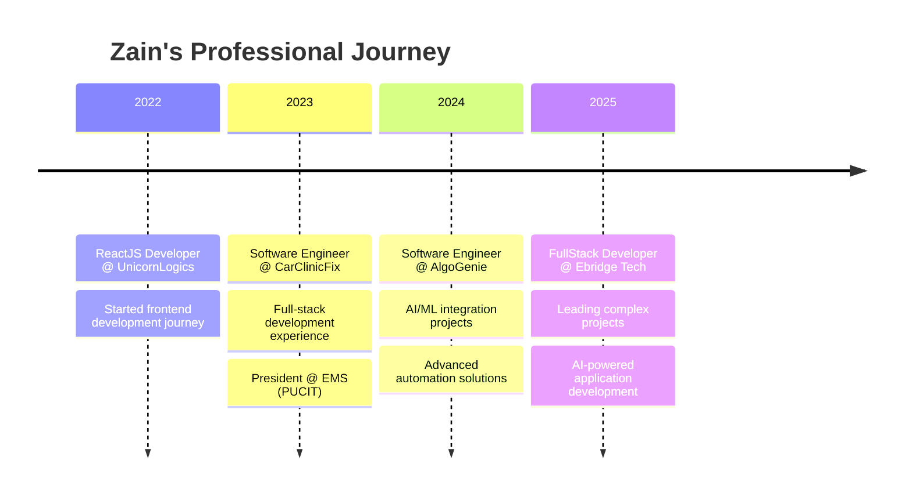

# <div align="center">🚀 Welcome to Zain's Digital Universe 🚀</div>

<div align="center">
  
<!-- Animated typing effect -->
[](https://git.io/typing-svg)

<!-- Animated banner -->


</div>

---

##  About Me


```typescript
const zain = {
    location: "Lahore, Pakistan 🇵🇰",
    currentFocus: ["AI Integrations", "Next.js", "Python Flask", "Automations"],
    passion: "Blending AI + Cloud + Automations to build impactful solutions",
    philosophy: "Code is poetry in motion ✨",
    availability: "Open to worldwide collaboration 🌍"
};

console.log("Building tomorrow's solutions today! 🚀");
```

<div align="center">
  
### 🌐 Connect With Me
  
[](https://www.linkedin.com/in/zain-amir-b23888a8)
[](https://www.ebridge.tech/)
[](https://github.com/Zain-Amir)
[](mailto:your.email@gmail.com)

</div>

---

##  Tech Arsenal

<div align="center">

### 💻 Frontend & Mobile


### 🎨 Styling & Design


### ⚙️ Backend & Database


### 🤖 AI & Machine Learning


### ☁️ Cloud & DevOps


### 🔧 CMS & Automation


</div>

---

##  Professional Journey

<div align="center">



</div>

---

##  Featured Projects

<div align="center">
  
<table>
<tr>
<td width="50%">

### 🏢 EquityBound
**Realtime Stock Learning Platform**
- 📊 Real-time stock data visualization
- 🤖 AI-powered predictions
- 📚 Interactive learning modules
- **Tech:** MERN Stack, WebSocket

[](https://github.com/Zain-Amir)

</td>
<td width="50%">

### 🧠 NimblIQ  
**AI-Gamified Learning Platform**
- 🎮 Interactive AI tutoring
- 🏆 Gamification elements
- 📱 Progressive learning paths
- **Tech:** React, Directus CMS, AI APIs

[](https://github.com/Zain-Amir)

</td>
</tr>
<tr>
<td width="50%">

### 📱 OptionsLounge
**Investment Management App**
- 💰 Portfolio tracking
- 📊 Real-time market data
- 🔔 Smart notifications
- **Tech:** React Native, Node.js

[](https://github.com/Zain-Amir)

</td>
<td width="50%">

### 🐕 Loyal Pets AI
**RAG-Based Pet Care Assistant**
- 🤖 AI-powered pet advice
- 💬 Natural language processing
- 📚 Comprehensive pet database
- **Tech:** Python, LangChain, RAG

[](https://github.com/Zain-Amir)

</td>
</tr>
</table>

</div>

---

##  GitHub Analytics

<div align="center">
  


<!-- Activity Graph -->
[](https://github.com/Zain-Amir)

</div>

---

##  Achievements & Recognition

<div align="center">
  
🏆 **Winner, AppFest 2023 (PUCIT)** - Quran Translation App (8-hour challenge)  
👑 **President, EMS (PUCIT)** - Led 50+ volunteers, organized job fairs  
❤️ **Vice President, Blood Donation Society** - Community service & leadership  

</div>

---

##  Current Focus

<div align="center">
  
```javascript
const currentGoals = {
    learning: ["Advanced AI/ML", "Cloud Architecture", "Microservices"],
    building: ["AI-powered SaaS platforms", "Automation workflows"],
    exploring: ["Web3 technologies", "Edge computing", "IoT integration"],
    contributing: "Open source projects & tech community"
};
```

</div>

---

##  Fun Facts

<div align="center">
  
- 🔭 I'm currently working on **AI-powered automation platforms**
- 🌱 I'm learning **Advanced Cloud Architecture** and **MLOps**
- 👯 I'm looking to collaborate on **Open source AI projects**
- 💬 Ask me about **React, AI integrations, and automation workflows**
- ⚡ Fun fact: **I built a Quran translation app in just 8 hours!**
- 🎯 2025 Goal: **Contribute to 50+ open source projects**

</div>

---

<div align="center">
  
### 💭 Quote of the Day
  
*"The best error message is the one that never shows up."* - Thomas Fuchs

---

### 🎵 Coding Soundtrack
  
[](https://open.spotify.com/user/31k6uxhpy5g4pdhlc7mbqkqvly2q)

---


### 🚀 Let's Build Something Amazing Together!

[](https://www.ebridge.tech/)
[](mailto:your.email@gmail.com)


</div>
